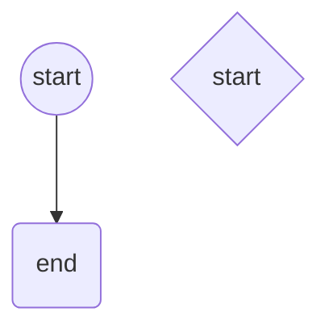

# Notes

## Blind Box

### Features

- Seller list their blind box
- Buyer can order from trading platform
- Chat Messages Features for Buyer / Seller
- Simple Sign Up / Login
- Before Buyer Complete Transaction, they need to register an account
- Can Browse Freely Before Transaction
- Support Claims Portal
- Ban Seller
- Refund Transaction
- Product Shipping / Logistics

## System Architecture

- WebView
- Redis (Make Faster)
- Postgres
- Backend
  - Express
  - Flask
  - Java / C#
  - Go
- React Native
  - Expo
  - iOS
  - Android
  - Web App

## Apps

- Seller App
- Buyer Appscreensaver
- Support Claims Portal
- Landing Page (Wordpress)

